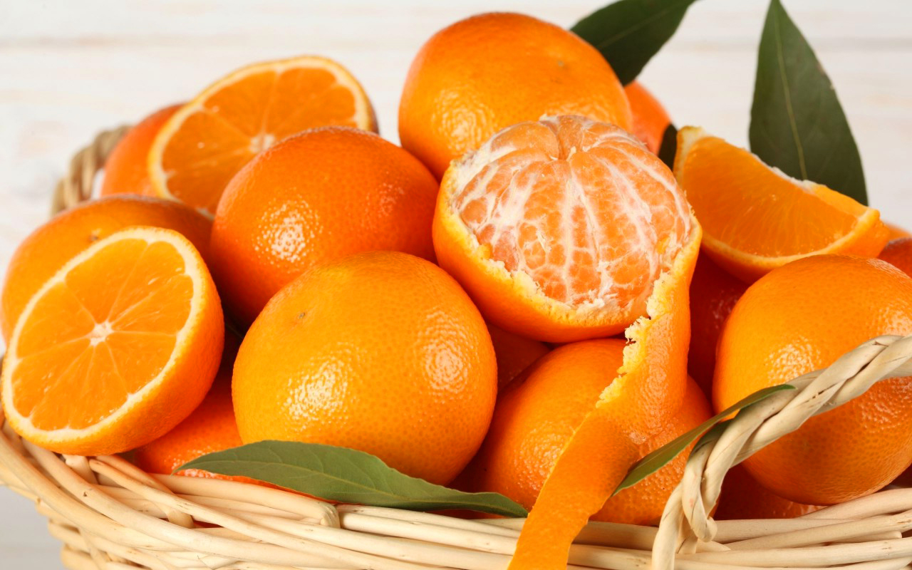

# Prediksi Kualitas Jeruk

## About
Proyek ini bertujuan untuk memprediksi kualitas jeruk dengan menggunakan teknologi pembelajaran mesin (machine learning). Dengan mengembangkan model prediksi yang andal, kami dapat membantu produsen jeruk dalam menilai kualitas hasil panen mereka secara lebih efisien dan akurat.

Fokus utama proyek ini adalah:

1. Efisiensi Produksi: Memberikan prediksi kualitas jeruk tanpa memerlukan pengujian manual yang memakan waktu dan biaya.
2. Peningkatan Mutu: Membantu produsen memastikan bahwa jeruk yang mereka hasilkan memenuhi standar kualitas yang diinginkan.
3. Keberlanjutan: Dengan data yang lebih akurat, produsen dapat mengelola hasil panen mereka secara lebih bijaksana dan mengurangi pemborosan.

Pendekatan yang digunakan melibatkan pengolahan data fisik dan kimia jeruk, seperti berat, ukuran, tingkat keasaman (pH), dan warna kulit, yang kemudian diolah menggunakan algoritma machine learning untuk memberikan prediksi kualitas secara otomatis.

Proyek ini dirancang untuk mendukung pengambilan keputusan yang lebih baik dan meningkatkan daya saing produsen jeruk di pasar lokal maupun internasional.

## Content
    .
    ├── README.md 
    ├── data
    │   └── Orange Quality Data.csv
    ├── model
    │   └── model_svr_jeruk.pkl
    ├── notebook
    │   └── main.ipynb
    ├──src
    |    └── app.py
    └── requirements.txt

## Feedback
Berikan saya feedback untuk mengimprove model yang saya bangun atau ingin berkontribusi lebih lanjut untuk project bisa hubungi saya melalui email: topikhidayat17081998@gmail.com
